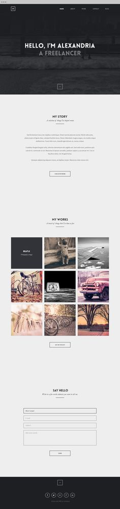
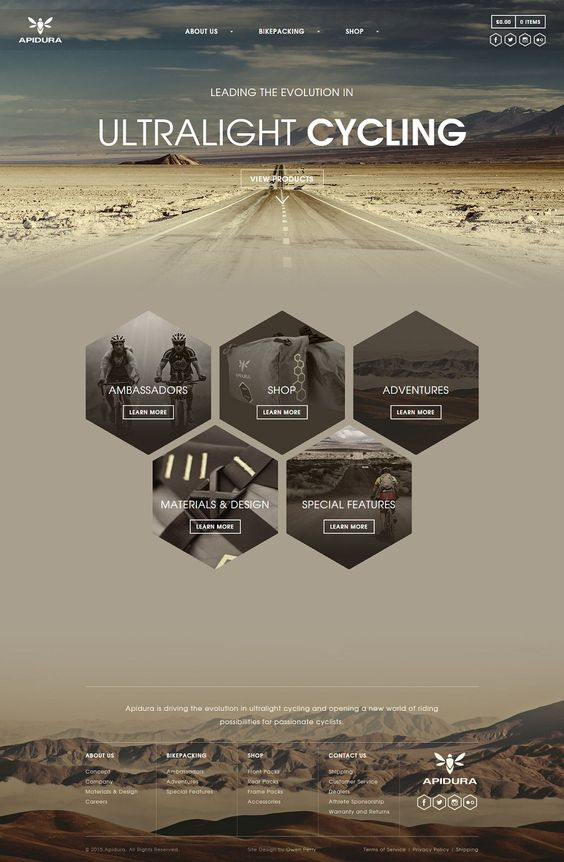
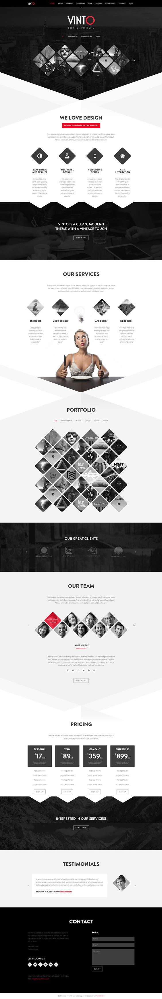
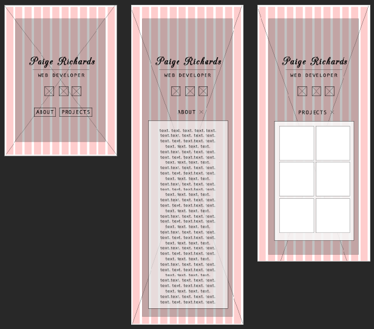
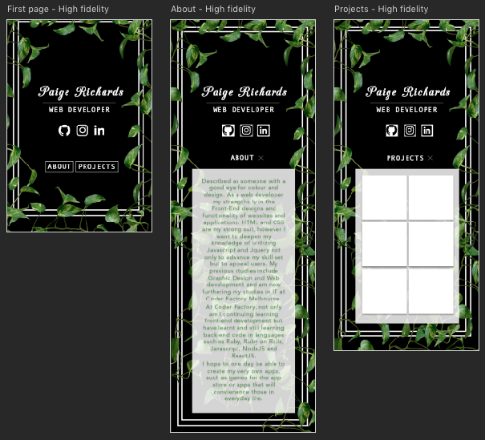
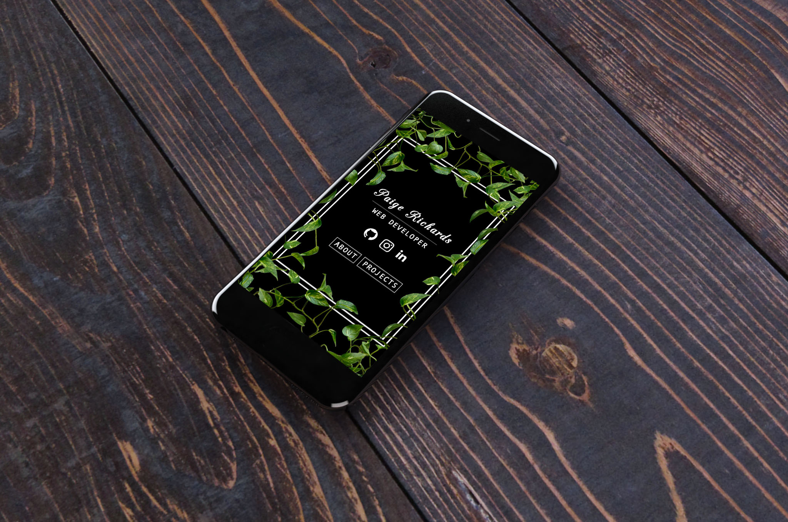
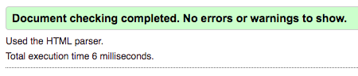
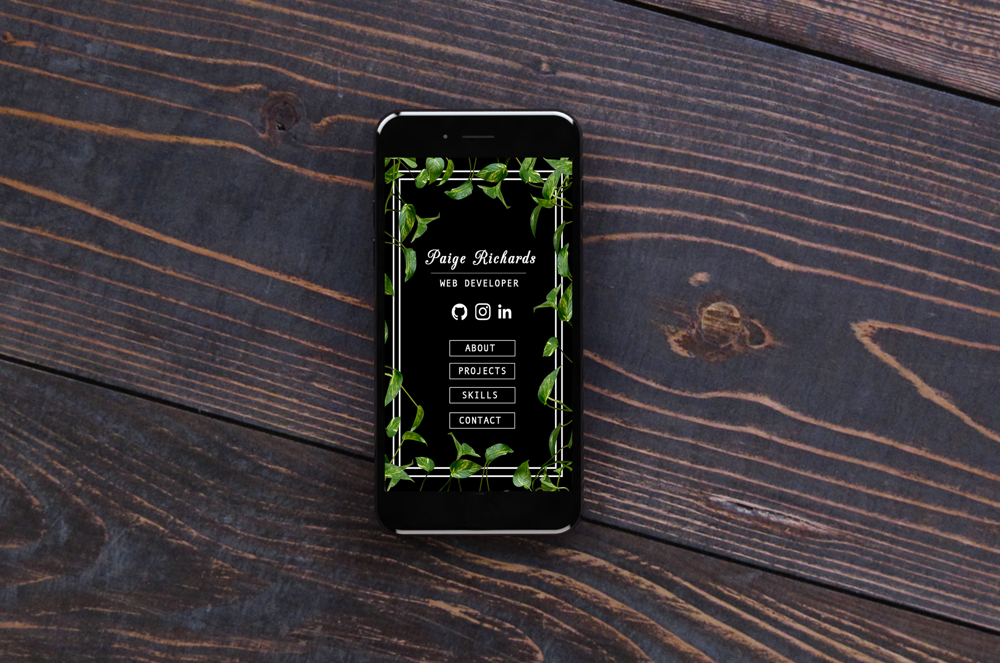

# My Portfolio Website
*For my portfolio website, I knew I wanted something simple with easy navigation for effective usability. I wanted a design that was very appealing but also reflected my objectives. In conjunction, important aspects included functional links to social media and the ability to be able to contact me. I chose a multipage website for SEO purposes.*

# Contents
  - Inspiration
  - Wireframes Low & High Fidelity
  - Changes / Improvements
  - Challenges
  - Code & Validation
  - Finish product

# Inspiration

*Below I have incorporated some of my inspiration for my website. I had lots of inspiration from many designs, but these stuck out the most.*

----------------------------------------------------------------------------------
 I was drawn to this for some inspiration as its very minimal, however utilizes a design that themes the whole website. The selection of colours really enhances the design and everything is nicely spaced and has been created with a strong grid system.

-  

-------------------------------------------------------------------------------------

I took a big liking to the way the web designer had created this site's homepage with the product links easily displayed in a navigation in the center of the page. This way the user wouldn't have to search through a traditional nav bar that typically isn't at such scale or placement.

- 

-------------------------------------------------------------------------------------

This website used a very strong design seen across all pages and I believe this is an important aspect in designing web pages. This person has also used a grid system effectively. Another great feature was the colour palette used. I think black is great to emphasis your site along with another colour such as how they've used red.

- 

-------------------------------------------------------------------------------------

# Wireframes
*For the creation of my wireframes, I used Photoshop.*

  
>Low fidelity:
This is the design I decided to use for my Portfolio Website. I knew I wanted a black background and some sort of background image for some personality. Over this, text in some areas on my site will have a transparent white box underneath to achieve sufficient legibility.

  
>High fidelity:
Progressing from low to high fidelity, I had to figure out what the background image would be. I knew I wanted something that would provide me with a themed color scheme with little amount of colors and would contrast well with black and white. I got thinking and decided I wanted to use a vine. I found an image of a little vine that I duplicated many times and was manipulated into what I desired. From this, I now would be incorporating green as text in places throughout my website. I decided to use two white borders around my content, to really frame the focus of the page. I think this was a nice idea. From these mockups, I knew I wanted a fancy font for my name and a sans-serif for all other type.

Mockup:

This was a mockup I created to get a real feel for my design and how it would be represented on mobile screen.

# Changes / Improvements

*I began to code by this stage and had most of the technical elements and style coded. I kept coming back to my design and I figured I needed more information about myself and a couple more pages to really show off my skills and desire to be a web developer. This then led me to the creation of the pages; skills and contact. I then furthered changes to design of the links to pages; instead of having them displayed as an inline-block, I wanted them as blocks.*

# Challenges
*My first idea for the vines was to make them grow around the page when loaded. I searched online for a while on how to do this and I found a step by step guide using Javascript. I decided not to go ahead with it, as I understood very little of the technicality being implemented. I plan in the future to update my site and do this once I've learnt Javascript in a bit more depth.
I faced issues with a type face 'CAC Champagne', that I so desperately wanted to use but would not render in its proper form on IOS. This then led me to use the google font 'Italianno' for my h1.*

# Code & Validation
*For SEO purposes and for personal preference, I wanted to validate my code. I went through and validated all my HTML and CSS pages and made changes until I received this message*

As you can see above, each page has been successfully passed with no errors.

# Finished Product
*After redesigning and coding I'm finally at the stage of a finished product.*

I'm pleased with the outcome of my portfolio website, it reflects my objectives I originally wanted; simple yet appealing and informative.
